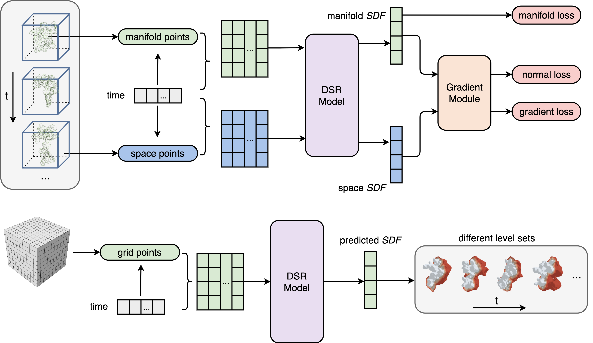
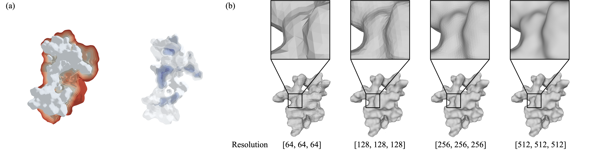

# DSR: Dynamical Surface Representation as Implicit Neural Networks for Protein
<p align="center">
  
</p>

This repository contains an implementation of the paper: "**DSR: Dynamical Surface Representation as Implicit Neural Networks for Protein**"

DSR is a novel neural network-based approach to modeling protein dynamics using an implicit representation of a protein's surface in 3D and time. Our method utilizes the zero-level set of signed distance functions (SDFs) to represent protein surfaces, enabling temporally and spatially continuous representations of protein dynamics. Our experimental results demonstrate that our model accurately captures protein dynamic trajectories and can interpolate and extrapolate in 3D and time. Importantly, this is the first study to introduce this method and successfully model large-scale protein dynamics. This approach offers a promising alternative to current methods, overcoming the limitations of first-principles-based and deep learning methods, and provides a more scalable and efficient approach to modeling protein dynamics. Additionally, our surface representation approach simplifies calculations and allows identifying movement trends and amplitudes of protein domains, making it a useful tool for protein dynamics research.

Please check our [project webpage](https://anonymouswk.github.io/DSR) for more details. 

## Installation Requirments

The code is compatible with python 3.8 and pytorch 1.12.0.  In addition, the following packages are required:
numpy, pyhocon, plotly, scikit-image, trimesh, pymol, mdtraj.

## Usage

We provide a demo data in folder `datasets/abeta_30` and its ground truth data `datasets/abeta_30_gt`. You can download the other data. 

### Datasets
You can obtain the demo data by running `python data_process.py`. 

And you can get the full data following the description in the paper. 


### Train the model

You can train the model for the demo data by running `bash run_scripts/run.sh`. For any data, run:

      ```
      python runner_igr_t.py --conf <conf_path> --gpu <0,1> --mode train --case <CASE_NAME> [--is_continue]
      ```
where `is_continue` can go on training. 

### Reconstruction

For the demo data, you can just reconstruct by running `bash run_scripts/run_reconstruction.sh`. For other pre-trained models, run:

   ```
      python runner_igr_t.py --conf <conf_path> --gpu <0,1> --mode reconstruction --case <CASE_NAME> --is_continue
   ```
You can modify the `reconstruction` part in the `conf` file according to the actual situation. 

### Spatial and temporal interpolation
For the demo data, you can just interpolate by running `bash run_scripts/run_interpolation.sh`. For other pre-trained models, run:

   ```
      python runner_igr_t.py --conf <conf_path> --gpu <0> --mode interpolation --is_continue [--plot_level_set] [--timestamp] [--ckpt]
   ```
   You can modify the `resolution`, `t,` and `path` of the `interpolation` part in the `conf` file to obtain protein surface representations at any time and any resolution. The loaded checkpoint can be specified by `--timestamp` and `--ckpt`. Besides, add the `--plot_level_set` option to save a multi-level set. 

<p align="center">
  
</p>

### Evaluation
For the demo data, you can evaluate by running `bash run_scripts/run_eval.sh`.

### Remark

You can train your own model using the pipeline above for any protein dynamical surface representation. 

